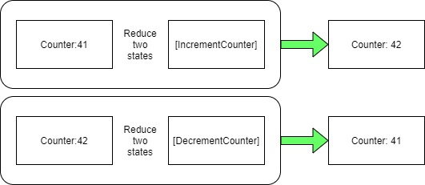
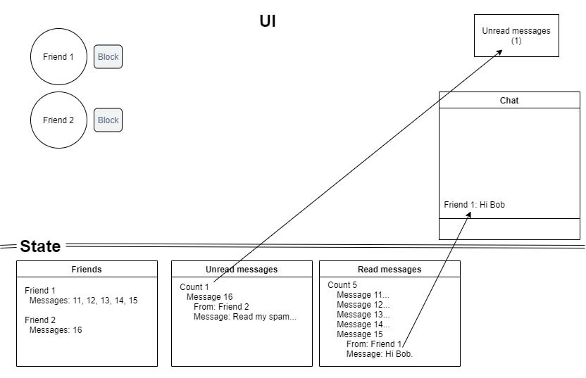
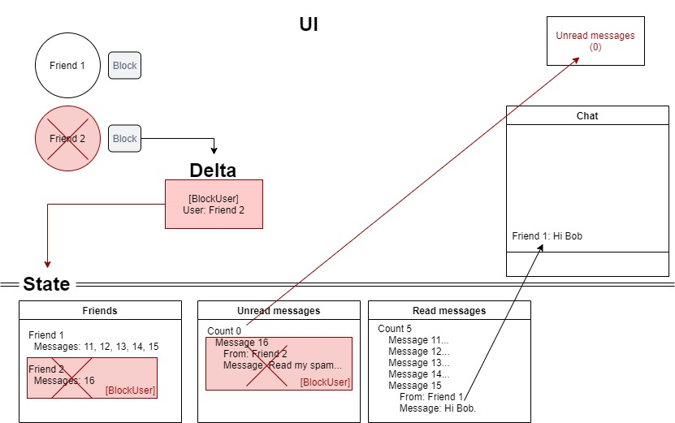

# Reducible - documentation

## Reducer pattern

Made popular by the JavaScript Redux library, and various other Flux pattern frameworks,
the Reducer pattern is a very simple concept. You can take pieces of data (states),
and reduce them into a single one new one.

The states being reduced don't need to be of the same type / structure.

If you consider the class type of the state, you can even consider an object with no properties as a state
that may be combined.

The latter is a perfect example of the Flux pattern, where an existing state is reduced with a `Delta` state (action)
to produce a new state.

The Delta state (called an action in Flux) can have any number of properties (e.g. `ClosedUtc` to record the date/time
it was closed), or no properties at all and the reducer determines the change based on the object type of the `Delta` state alone.

**Reducer rules**
* Reducers should not modify existing state; read-only state is better, but not essential.
* Reducers should be pure functions; meaning that the output should be derived from the input only,
  and not any additional sources such as databases, API calls, or the current Date/Time.
* Reducers should produce new state as its output.

## Tutorials

Read through the following tutorials in order to get a better idea of how this
library helps to achieve your goals, and what kind of features are available to
simplify the task.

* [Simple reducers](../Source/Tutorials/01-SimpleReducers/README.md)
* [Conditional reducers](../Source/Tutorials/02-ConditionalReducers/README.md)
* [Composite reducers](../Source/Tutorials/03-CompositeReducers/README.md)
* [Nested reducers](../Source/Tutorials/04-NestedReducers/README.md)
* [Composite nested reducers](../Source/Tutorials/05-CompositeNestedReducers/README.md)
* [Polymorphic reducers](../Source/Tutorials/06-PolymorphicReducers/README.md)

## Why?

Your state is your source of truth. If you want to change what is true, you have
to take action.

Facebook notoriously had a problem with their chat feature. The notification
at the top of the screen would show there were `X` new unread messages, but when the
user clicked on their chat box they would see there were none.

Scanning all messages to see how many are read/unread just to display `X unread`
at the top of the screen would have been expensive, so Facebook decided to store
the unread-count separately for efficiency. With different ways of altering the
number of unread messages, the number started to get out of sync.

*Different ways the unread count could be altered*
* A new message is received
* A message is read on the website
* A notification is received that you've read a message on your phone
* You block a user

Functional reducers allow you to create your state (source of truth) in a way
that makes it easy to prevent it from contradicting itself.

Taking your initial state of having 45 read messages and 5 unread, you can reduce
that current state with a `Delta` state indicating that message X has been read. This
not only marks that message as read, but also changes the number of unread messages, so
they stay in sync.

Blocking a user not only marks them as blocked, but also removes all of their messages
from your inbox, and decrements the number of unread messages.

Instead of each operation altering different bits of state, reducers switch the
responsibility around. The individual parts of the state react to actions.

In this scenario, a new addition to our friends list turns out to be a spammer. So
we click the `[Block]` button.

1. A reducer on the `Friends` state knows it needs to remove the friend.
2. A reducer on the `Unread messages` state knows to remove that user's messages.
3. That same reducer adjusts the `Count` based on how many messages were removed.
4. A reducer on the `Read messages` state doesn't need to do anything.

