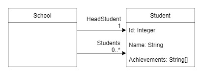

# Reducible

## Composite nested reducers
### Goal
We've now seen how to compose reducers horizontally, and reuse reducers vertically
down the state tree.

This tutorial will demonstrate how we can also take reducers that reuse in this way
and compose them into a single reducer.


### Instructions

Create a new console app with the following `State` and `Delta` classes

```c#
record School(ImmutableArray<Student> Students, Student HeadStudent);
record Student (int Id, string Name)
{
  public ImmutableHashSet<string> Achievements { get; init; } = ImmutableHashSet.Create<string>(StringComparer.InvariantCultureIgnoreCase);
}

record AddStudentAchievement(int StudentId, string Achievement);
```

We now have a state that has two paths to `Student` instances. One via the `Students` property, and one via
the `HeadStudent` property.

**State diagram**




### Requirements
We now need to add a `HeadStudent` property to our `School`. We need to make sure the
`HeadStudent` state cannot contradict the state that represents the same state in the `Students` property when
we reduce the `Student` state with the `AddStudentAchievement` delta.

If the student identified in the `Delta` is also the `HeadStudent` then our reducer should

1. Create new state for the individual `Student` in `HeadStudent` with the achievement included.
2. A new `School` state that holds a reference to the the `HeadStudent` state.


#### Step 1 - Student reducer

Add a reducer to combine the `Student` state in `School.HeadStudent` with the `AddStudentAchievement` delta.

```c#
var schoolHeadStudentAddAchievementReducer = Reducer
  .Given<School, AddStudentAchievement>()
  .WhenReducedBy(x => x.HeadStudent, studentAddAchievementReducer)
  .Then((school, headStudent) => school with { HeadStudent = headStudent });
```

* **Given** the inputs are a `School` state and an `AddStudentAchievement` delta
* **When** the `HeadStudent` state is reduced by the specified `studentAddAchievementReducer`
* **Then** we need a new `School` state based on the current state, but with the `HeadStudent` state replaced.

**Note**: The `WhenReducedBy` method here references a single object rather than an `Immutable<Student>`.

#### Composing the two school reducers

So far we have two reducers that take a `School` state and `AddStudentAchievement` delta and produce a new `School` state,
one for reducing the `Students` collection property and one that reduces only the `HeadStudent` property.

We could call these reducers in series, like so...

```c#
(bool changed, school) = schoolHeadStudentAddAchievementReducer(school);
(changed, school) = schoolStudentsAddAchievementReducer(school);

```

but, as mentioned in [Tutorial 4](./../04-NestedReducers/README.md), this would mean every part of the app that wants to reduce
a school would have to do the same, and this would quickly become error prone and unmanageable.

Instead, we want to combine these two reducers into a single reducer that can be used elsewhere without consumers having to
be concerned about exactly what happens within it.

```c#
var schoolAddStudentAchievementReducer =
  Reducer.Combine(schoolHeadStudentAddAchievementReducer, schoolStudentsAddAchievementReducer);
```


### Writing the consuming code

Add the following code to execute the nested reducer.

```c#
var student1 = new Student(1, "Peter Morris");
var student2 = new Student(2, "Steven Cramer");

var allStudents = ImmutableArray.Create<Student>(student1, student2);
var school = new School(allStudents, HeadStudent: student2);

var addAchievementDelta = new AddStudentAchievement(2, "Smells");

for (int i = 0; i < 2; i++)
{
  (bool changed, school) = schoolAddStudentAchievementReducer(school, addAchievementDelta);
}
```

The state in this example changes as follows, note again how when Steven Cramer's state does not change, the
school's state doesn't change either.

```
Original state={
  "Students": [
    {
      "Id": 1,
      "Name": "Peter Morris",
      "Achievements": []
    },
    {
      "Id": 2,
      "Name": "Steven Cramer",
      "Achievements": []
    }
  ],
  "HeadStudent": {
    "Id": 2,
    "Name": "Steven Cramer",
    "Achievements": []
  }
}

Step=1, Changed=True, State={
  "Students": [
    {
      "Id": 1,
      "Name": "Peter Morris",
      "Achievements": []
    },
    {
      "Id": 2,
      "Name": "Steven Cramer",
      "Achievements": [
        "Smells"
      ]
    }
  ],
  "HeadStudent": {
    "Id": 2,
    "Name": "Steven Cramer",
    "Achievements": [
      "Smells"
    ]
  }
}

Step=2, Changed=False, State={
  "Students": [
    {
      "Id": 1,
      "Name": "Peter Morris",
      "Achievements": []
    },
    {
      "Id": 2,
      "Name": "Steven Cramer",
      "Achievements": [
        "Smells"
      ]
    }
  ],
  "HeadStudent": {
    "Id": 2,
    "Name": "Steven Cramer",
    "Achievements": [
      "Smells"
    ]
  }
}
```

### Summary
1. Nesting reducers allows us to keep our reducers concerned only on a single state type.
2. It is also possible to use nested reducers on single objects rather than only `ImmutableArray<T>` properties. 
3. When more than one reduce step is required, these should be combined into a single reducer, this also applies to complex
   reducers that utilise other "nested" reducers for reducing state further down its state tree.