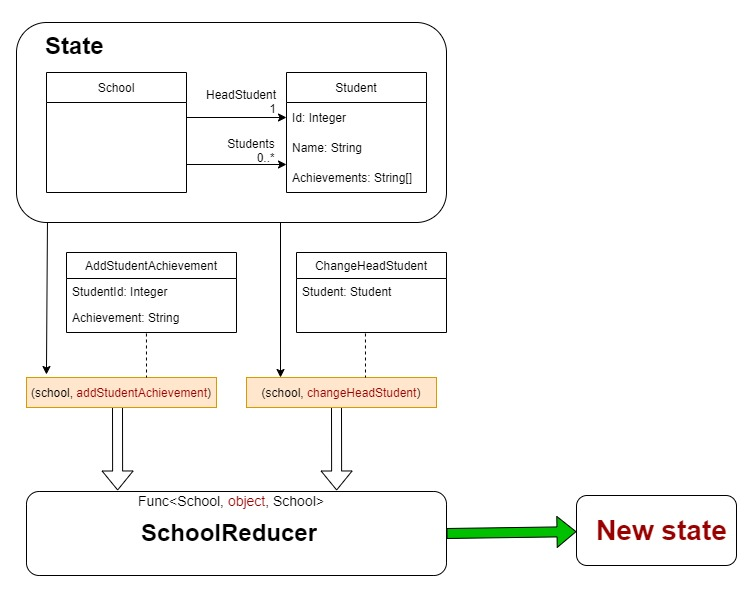
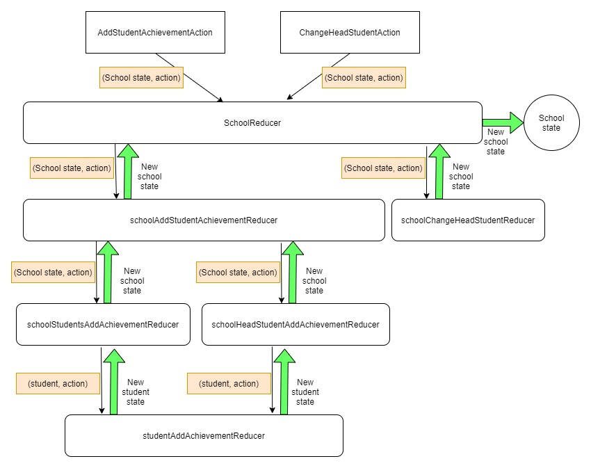

# Reducible

## Polymorphic reducers
### Goal
We've now seen how to combine reducers horizontally on the same `TState` type and the same `Delta` class type.
`<School, AddStudentAchievement>`.

We've also seen how to reuse a reducer to reduce a different `TState` type (`Student`), but so far we've only shown how to
create reducers that can reduce a specific `Delta` type.

1. `<School, AddStudentAchievement>`
2. `<Student, AddStudentAchievement>`

This tutorial will demonstrate how we can also take reducers that work on different `Delta` states and combine them into a single
reducer that can accept any type of `Delta` and execute only the reducers defined to handle that `Delta` state type.

### Requirements
We now need the ability to change the `HeadStudent` property of our `School`. If the student identified in
the `Delta` is not already the `HeadStudent` our reducer should create a new
`School` state with the `HeadStudent` from the Delta state.

### Instructions

Create a new console app with the following `State` and `Delta` classes

```c#
record School(ImmutableArray<Student> Students, Student HeadStudent);
record Student(int Id, string Name)
{
  public ImmutableHashSet<string> Achievements { get; init; } = ImmutableHashSet.Create<string>(StringComparer.InvariantCultureIgnoreCase);
}

record AddStudentAchievement(int StudentId, string Achievement);
record ChangeHeadStudent(Student Student);
```

These are the same as in [Tutorial 5](./../05-CompositeNestedReducers/README.md), but with the addition of a
`ChangeHeadStudent` delta which we will use to change the school's `HeadStudent`.

Add the reducers from Tutorial 5 as follows:

```c#
var studentAddAchievementReducer = Reducer
	.Given<Student, AddStudentAchievement>()
	.When((student, delta) => student.Id == delta.StudentId && !student.Achievements.Contains(delta.Achievement))
	.Then((student, delta) => student with { Achievements = student.Achievements.Add(delta.Achievement) });

var schoolStudentsAddAchievementReducer = Reducer
	.Given<School, AddStudentAchievement>()
	.WhenReducedBy(x => x.Students, studentAddAchievementReducer)
	.Then((school, students) => school with { Students = students });

var schoolHeadStudentAddAchievementReducer = Reducer
	.Given<School, AddStudentAchievement>()
	.WhenReducedBy(x => x.HeadStudent, studentAddAchievementReducer)
	.Then((school, headStudent) => school with { HeadStudent = headStudent });

var schoolAddStudentAchievementReducer = Reducer.Combine(schoolHeadStudentAddAchievementReducer, schoolStudentsAddAchievementReducer);
```

**State diagram**




#### School change head student reducer

Now add a reducer to combine the `School` state `ChangeHeadStudent` delta.

```c#
var schoolChangeHeadStudentReducer = Reducer
  .Given<School, ChangeHeadStudent>()
  .When((school, delta) => school.HeadStudent.Id != delta.Student.Id)
  .Then((student, delta) => student with { HeadStudent = delta.Student });
```

* **Given** the inputs are a `School` state and a `ChangeHeadStudent` delta
* **When** the school has a `HeadStudent` that has a different `Id` to the one in the delta
* **Then** we need a new `School` state based on the current state, but with the `HeadStudent` state replaced.

#### Composing the two school reducers

Now we have two reducers that work on the same `State` type, but expect different `Delta` types. Because they expect different
`Delta` types, this means consumers of our reducers won't make the mistake of calling one without the other, because you would
call one *or* the other depending on what you wish to change.

It would be ideal if we could combine these top-level `School` reducers into a single reducer. This way, consumers would know there
is only a single reducer for `School` to which they can pass any `Delta` type, and won't have to dig to find which one they should
be calling.

We could even make all reducers internal to our assembly except the ones the consumer should access.

The signatures for these two `School` reducers are as follows
* `schoolAddStudentAchievementReducer` **is of type** `Func<School, AddStudentAchievement, School>`
* `schoolChangeHeadStudentReducer` **is of type** `Func<School, ChangeHeadStudent, School>`

And `Reducer.Combine` expects a `params` array of two or more `Func` of the **same** type, so it cannot combine them.


#### Using a Reducer.CreateBuilder&lt;TState&gt;

Using the `Add` method on `Reducer.Builder<TState>` it is possible to combine reducers with various `Delta` types as long
as they receive and return the same `TState` type. In our case this would be

* Func<**School**, *AddStudentAchievement*, **School**>
* Func<**School**, *ChangeHeadStudent*, **School**>

The convention for building with `Reducer.CreateBuilder<T>` is as follows:

```c#
var schoolReducer = Reducer.CreateBuilder<School>()
  .Add(schoolAddStudentAchievementReducer)
  .Add(schoolChangeHeadStudentReducer)
  .Build();
```

Combining these reducers with `Reducer.CreateBuilder<TState>` returns a function with a signature of
`Func<TState, object, TState`. Meaning passing objects of any type as the `Delta`, and the `TState` will only have an
affect if there is a reducer that reduces that `Delta` state into the `TState`. The `Delta` state can be an object of
any form, making it a polymorphic reducer.

### Writing the consuming code

Use the following code to create and execute our polymorphic `School` reducer.

```c#
#region Reducers from previous example
// Create a reducer that adds an achievement to a student
// with a specific Id, only if they do not already
// have that achievement.
var studentAddAchievementReducer = Reducer
  .Given<Student, AddStudentAchievement>()
  .When((student, delta) => student.Id == delta.StudentId && !student.Achievements.Contains(delta.Achievement))
  .Then((student, delta) => student with { Achievements = student.Achievements.Add(delta.Achievement) });

// Create a reducer for the school, which uses the previous reducer
// on each student in its `ImmutableArray<Student> Students` property
// to add an achievement to a student with a specific Id if they do not
// already have that achievement.
var schoolStudentsAddAchievementReducer = Reducer
  .Given<School, AddStudentAchievement>()
  .WhenReducedBy(x => x.Students, studentAddAchievementReducer)
  .Then((school, students) => school with { Students = students });

// Create a reducer for the school, which uses the student reducer
// on its `Student HeadStudent` property
// to add an achievement if they have the correct Id and if they do not
// already have that achievement.
var schoolHeadStudentAddAchievementReducer = Reducer
  .Given<School, AddStudentAchievement>()
  .WhenReducedBy(x => x.HeadStudent, studentAddAchievementReducer)
  .Then((school, headStudent) => school with { HeadStudent = headStudent });

// Create a combined reducer that takes School as a state,
// AddStudentAchievementAction as an action
// and returns new school state if any of the Students or the HeadStudent
// states were modified.
var schoolAddStudentAchievementReducer = Reducer.Combine(schoolHeadStudentAddAchievementReducer, schoolStudentsAddAchievementReducer);
#endregion

// Create a reducer that replaces the head student
// of the school, because Steven Cramer is too smelly.
var schoolChangeHeadStudentReducer = Reducer
  .Given<School, ChangeHeadStudent>()
  .When((school, delta) => school.HeadStudent.Id != delta.Student.Id)
  .Then((student, delta) => student with { HeadStudent = delta.Student });

var student1 = new Student(1, "Peter Morris");
var student2 = new Student(2, "Steven Cramer");

var allStudents = ImmutableArray.Create<Student>(student1, student2);
var school = new School(allStudents, HeadStudent: student2);

var addAchievementDelta = new AddStudentAchievement(2, "Smells");
var changeHeadStudentDelta = new ChangeHeadStudent(student1);


// Now build a reducer that can handle both
// `Delta` types by allowing us to pass `TState` + `object`
var schoolReducer = Reducer.CreateBuilder<School>()
  .Add(schoolAddStudentAchievementReducer)
  .Add(schoolChangeHeadStudentReducer)
  .Build();


(bool changed, school) = schoolReducer(school, addAchievementDelta);
(changed, school) = schoolReducer(school, changeHeadStudentDelta);
(changed, school) = schoolReducer(school, "We don't have a reducer for a simple string delta, so this does nothing");
```

The state in this example changes as follows, note how a single reducer is used to reduce any `Delta` state, and how
trying to reduce with an unknown `Delta` state has no effect. Not only does this make it possible to dispatch all `Delta`
states to a single reducer for School, but also gives us the ability to create a single `root` reducer for our whole state,
so the consumers of our reducers never need to worry about which reducer they should use.

```
Step=0, Changed=False,
State={
  "Students": [
    {
      "Id": 1,
      "Name": "Peter Morris",
      "Achievements": []
    },
    {
      "Id": 2,
      "Name": "Steven Cramer",
      "Achievements": []
    }
  ],
  "HeadStudent": {
    "Id": 2,
    "Name": "Steven Cramer",
    "Achievements": []
  }
}

Step=1, Changed=True,
State={
  "Students": [
    {
      "Id": 1,
      "Name": "Peter Morris",
      "Achievements": []
    },
    {
      "Id": 2,
      "Name": "Steven Cramer",
      "Achievements": [
        "Smells"
      ]
    }
  ],
  "HeadStudent": {
    "Id": 2,
    "Name": "Steven Cramer",
    "Achievements": [
      "Smells"
    ]
  }
}

Step=2, Changed=True,
State={
  "Students": [
    {
      "Id": 1,
      "Name": "Peter Morris",
      "Achievements": []
    },
    {
      "Id": 2,
      "Name": "Steven Cramer",
      "Achievements": [
        "Smells"
      ]
    }
  ],
  "HeadStudent": {
    "Id": 1,
    "Name": "Peter Morris",
    "Achievements": []
  }
}

Step=3, Changed=False,
State={
  "Students": [
    {
      "Id": 1,
      "Name": "Peter Morris",
      "Achievements": []
    },
    {
      "Id": 2,
      "Name": "Steven Cramer",
      "Achievements": [
        "Smells"
      ]
    }
  ],
  "HeadStudent": {
    "Id": 1,
    "Name": "Peter Morris",
    "Achievements": []
  }
}
```

### Summary
1. It is possible to combine reducers with different `Delta` class types by using `Reducer.CreateBuilder<TState>`.
2. You can pass as many existing reducers as you wish, but they must all have the same `TState` type.
2. The signature of the reducer returned will be `Func<TState, object, TState>`.
3. It is possible to reduce a `Delta` of **any** class type into this reducer, any type without a reducer will have no effect.

In only a few lines of code (most if it is comments) we were able to create the following state system.


